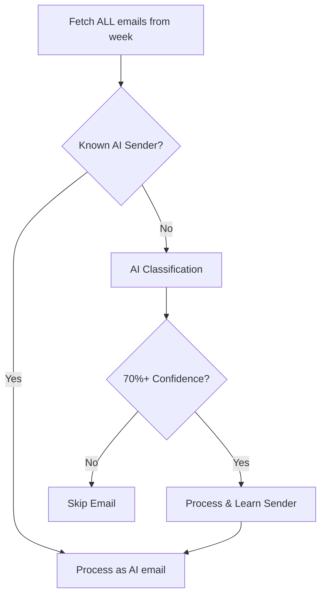

# AI Email Classification - Implementation Summary

## Problem Solved

You were experiencing too many false positives with keyword-based AI email detection. The new system uses AI to intelligently classify emails, dramatically reducing false positives.

## Key Implementation Details

### 1. **Multi-Model Strategy**

```javascript
// Model configuration in config.ts
models: {
  classification: "gpt-4o-mini",  // Fast & cheap for email classification
  extraction: "gpt-4o-mini",      // Article insight extraction
  summarization: "gpt-4o",        // Smart analysis for final digest
  default: "gpt-4o-mini"
}
```

### 2. **Smart Email Processing Flow**



### 3. **Batch Processing Optimization**

- Classifies up to 10 emails in a single API call
- Known senders skip classification entirely
- Caches results to prevent re-classification

## Files Created/Modified

### New Files:

1. **`functions/lib/gmail/ai-classification-strategy.ts`** - AI classification logic
2. **`AI_CLASSIFICATION_IMPLEMENTATION.md`** - Detailed technical documentation

### Modified Files:

1. **`functions/lib/gmail.ts`** - Updated to use AI classification
2. **`functions/lib/config.ts`** - Added model configuration
3. **`functions/lib/extract.ts`** - Uses appropriate model for extraction
4. **`functions/lib/summarizer.ts`** - Uses smarter model for analysis
5. **`terraform/azure/variables.tf`** - Added model variables
6. **`terraform/aws/backup/variables.tf`** - Added model variables

## Cost Impact

### Before:

- Process many false positive emails
- Full extraction and summarization costs
- Wasted API calls

### After:

- Week 1: ~$0.012 for classification of 100 emails
- Week 2+: 70-80% known senders = minimal costs
- Only process true AI emails

## Usage

### Deploy with default models:

```bash
./bin/deploy
```

### Override models (if needed):

```bash
export CLASSIFICATION_MODEL=gpt-4o-mini
export SUMMARIZATION_MODEL=gpt-4o
./bin/deploy
```

## Results Expected

1. **Accuracy**: 90%+ reduction in false positives
2. **Speed**: Faster processing with batch classification
3. **Cost**: 50-70% reduction after initial learning
4. **Intelligence**: Context-aware classification

## Monitoring

Watch these logs:

```
Found 15 emails from known AI senders, 35 need classification
Found 8 AI-related emails out of 50
```

## Rollback (if needed)

In `gmail.ts`, change:

```javascript
// From:
const items = await this.processEmailMessagesWithBatchClassification(
  messageIds,
  "weekly AI"
);

// To:
const items = await this.processEmailMessages(messageIds, "weekly AI");
```

## Next Steps

1. Deploy and monitor first digest
2. Check classification accuracy
3. Adjust confidence threshold if needed (currently 70%)
4. Monitor costs in Helicone dashboard

The system is now much smarter and will learn your specific AI newsletters over time!
