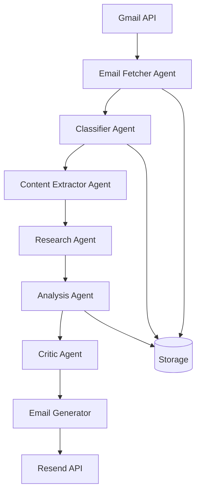

# AI Digest Architecture Documentation

## System Overview

AI Digest is a multi-cloud automated newsletter summarization system built with TypeScript, supporting both Azure Functions and AWS Lambda deployments.

## High-Level Architecture



## Agent-Based Architecture

### Core Agents

#### EmailFetcherAgent
- **Purpose**: Fetches emails from Gmail
- **Optimization**: Metadata-first approach (70% API reduction)
- **Location**: `functions/lib/agents/EmailFetcherAgent.ts`

#### ClassifierAgent
- **Purpose**: Classifies emails as AI-related or not
- **Method**: Batch processing of unknown senders
- **Location**: `functions/lib/agents/ClassifierAgent.ts`

#### ContentExtractorAgent
- **Purpose**: Extracts article content from email links
- **Integration**: Firecrawl API
- **Location**: `functions/lib/agents/ContentExtractorAgent.ts`

#### ResearchAgent
- **Purpose**: Enriches content with additional context
- **Integration**: Brave Search API
- **Location**: `functions/lib/agents/ResearchAgent.ts`

#### AnalysisAgent
- **Purpose**: Deep analysis and summarization
- **Model**: GPT-4o/GPT-5 with high reasoning
- **Location**: `functions/lib/agents/AnalysisAgent.ts`

#### CriticAgent
- **Purpose**: Generates opinionated commentary
- **Style**: Direct, actionable insights
- **Location**: `functions/lib/agents/CriticAgent.ts`

### DigestProcessor Orchestration

The `DigestProcessor` class coordinates all agents:

```typescript
class DigestProcessor {
  private emailFetcher: EmailFetcherAgent
  private classifier: ClassifierAgent
  private extractor: ContentExtractorAgent
  private researcher: ResearchAgent
  private analyst: AnalysisAgent
  private critic: CriticAgent
  
  async processWeeklyDigest() {
    // 1. Fetch emails
    // 2. Classify senders
    // 3. Extract content
    // 4. Research context
    // 5. Analyze content
    // 6. Generate critique
    // 7. Send digest
  }
}
```

## Multi-Cloud Architecture

### Directory Structure

```
functions/
├── core/                   # Shared business logic
│   └── digest-processor.ts
├── handlers/
│   ├── aws/               # AWS Lambda handlers
│   ├── azure/             # Azure Function handlers
│   └── unified/           # Platform-agnostic handlers
└── lib/
    ├── interfaces/        # Cloud-agnostic interfaces
    ├── aws/              # AWS implementations
    └── azure/            # Azure implementations
```

### Platform Abstraction

The system uses interfaces to abstract cloud-specific implementations:

```typescript
interface IStorageClient {
  getProcessedEmails(): Promise<string[]>
  markEmailProcessed(id: string): Promise<void>
  getKnownSenders(): Promise<Map<string, SenderInfo>>
  updateKnownSender(email: string, info: SenderInfo): Promise<void>
}
```

### Service Mappings

| Component | Azure | AWS |
|-----------|-------|-----|
| Compute | Azure Functions | Lambda |
| Storage | Table Storage | DynamoDB/S3 |
| Secrets | Key Vault | Secrets Manager |
| Scheduling | Timer Trigger | EventBridge |
| Monitoring | Application Insights | CloudWatch |

## Data Flow

### Weekly Digest Flow

1. **Trigger**: Timer/EventBridge or manual HTTP trigger
2. **Fetch**: Get emails from last 7 days
3. **Filter**: Remove processed emails
4. **Classify**: Identify AI-related emails
5. **Extract**: Get article content
6. **Research**: Add context from web
7. **Analyze**: Generate summaries
8. **Critique**: Add commentary
9. **Send**: Format and deliver email

### Cleanup Mode Flow

1. **Trigger**: Manual with `cleanup=true` parameter
2. **Fetch**: Get ALL unarchived emails
3. **Batch**: Process in groups of 50
4. **Delay**: 5-second pause between batches
5. **Process**: Same as weekly flow per batch
6. **Archive**: Mark emails as processed
7. **Multiple Outputs**: One digest per batch

## External Integrations

### Gmail API
- **Auth**: OAuth2 with refresh tokens
- **Scopes**: `gmail.modify`
- **Rate Limits**: 250 quota units/user/second
- **Batch Limits**: 100 messages per request

### OpenAI API
- **Models**: GPT-4o-mini (default), GPT-4o, GPT-5
- **Integration**: Vercel AI SDK
- **Observability**: Helicone proxy
- **Context Limits**: 50 emails per batch

### Firecrawl
- **Purpose**: Web content extraction
- **Rate Limits**: 100 requests/minute
- **Fallback**: Basic HTML parsing

### Brave Search
- **Purpose**: Research augmentation
- **Limits**: 2000 queries/month (free tier)
- **Usage**: 5-10 queries per digest

### Resend
- **Purpose**: Email delivery
- **Features**: React Email templates
- **Styling**: Tailwind CSS (inline)

## Circuit Breaker Pattern

All external API calls use circuit breakers:

```typescript
class CircuitBreaker {
  private failures = 0
  private lastFailureTime = 0
  private state: 'CLOSED' | 'OPEN' | 'HALF_OPEN' = 'CLOSED'
  
  async execute(fn: Function) {
    if (this.state === 'OPEN') {
      if (Date.now() - this.lastFailureTime > 30000) {
        this.state = 'HALF_OPEN'
      } else {
        throw new Error('Circuit breaker is OPEN')
      }
    }
    
    try {
      const result = await fn()
      this.failures = 0
      this.state = 'CLOSED'
      return result
    } catch (error) {
      this.failures++
      this.lastFailureTime = Date.now()
      if (this.failures >= 3) {
        this.state = 'OPEN'
      }
      throw error
    }
  }
}
```

## Cost Optimization

### Cost Tracking

```typescript
class CostTracker {
  private costs = {
    openai: 0,
    firecrawl: 0,
    brave: 0,
    total: 0
  }
  
  addCost(service: string, amount: number) {
    this.costs[service] += amount
    this.costs.total += amount
    
    if (this.costs.total > MAX_COST_LIMIT) {
      throw new Error('Cost limit exceeded')
    }
  }
}
```

### Optimization Strategies

1. **Metadata-First Fetching**: Reduces Gmail API calls by 70%
2. **Sender Caching**: Remembers AI/non-AI classification
3. **Batch Processing**: Minimizes API round trips
4. **Helicone Caching**: Reduces duplicate OpenAI calls
5. **Circuit Breakers**: Prevents cascade failures

## Storage Patterns

### Processed Emails Tracking

```typescript
interface ProcessedEmail {
  id: string
  processedAt: Date
  digest: string
  cost: number
}
```

### Known Senders Learning

```typescript
interface KnownSender {
  email: string
  classification: 'AI' | 'NOT_AI'
  confidence: number
  lastSeen: Date
  processCount: number
}
```

### Confidence Decay

Sender classifications decay over time:
- Initial confidence: 1.0
- Decay rate: 0.95 per week
- Re-classification threshold: 0.5

## Security Architecture

### Authentication & Authorization
- **Gmail**: OAuth2 with refresh tokens
- **Azure**: Managed Identity for Key Vault
- **AWS**: IAM roles for service access
- **API Keys**: Stored in Key Vault/Secrets Manager

### Data Protection
- **No Password Storage**: OAuth only
- **Encrypted at Rest**: All storage services
- **Encrypted in Transit**: HTTPS only
- **No PII in Logs**: Structured logging

### Secret Management
- **Azure**: Key Vault with managed identity
- **AWS**: Secrets Manager with IAM roles
- **Rotation**: Manual (automated planned)

## Error Handling

### Result Pattern

```typescript
type Result<T, E = Error> = 
  | { ok: true; value: T }
  | { ok: false; error: E }

function processEmail(email: Email): Result<ProcessedEmail> {
  try {
    // Processing logic
    return { ok: true, value: processed }
  } catch (error) {
    return { ok: false, error }
  }
}
```

### Graceful Degradation

1. **Firecrawl Fails**: Fall back to basic HTML parsing
2. **Research Fails**: Continue without enrichment
3. **Cost Limit Hit**: Process with smaller model
4. **Gmail Rate Limited**: Retry with exponential backoff

## Performance Characteristics

### Execution Times
- **Email Fetching**: 5-30 seconds
- **Classification**: 10-20 seconds
- **Content Extraction**: 30-60 seconds
- **Research**: 15-30 seconds
- **Analysis**: 60-120 seconds
- **Total Weekly**: 2-4 minutes
- **Total Cleanup**: 5-10 minutes per batch

### Resource Usage
- **Lambda Memory**: 256MB (most), 1024MB (analysis)
- **Lambda Timeout**: 5min (run-now), 15min (weekly)
- **Storage**: < 5GB typical
- **API Calls**: ~100-200 per digest

### Scalability
- **Serverless**: Auto-scales with load
- **Batch Processing**: Handles large volumes
- **Cost Limits**: Prevents runaway expenses
- **Circuit Breakers**: Prevents cascade failures

## Deployment Architecture

### Infrastructure as Code
- **Tool**: Terraform
- **Modules**: Separate for Azure and AWS
- **State**: Remote backend (S3/Azure Storage)

### CI/CD Pipeline
- **Build**: esbuild with TypeScript
- **Test**: Vitest with MSW
- **Deploy**: Terraform apply
- **Rollback**: Terraform state management

### Environment Management
- **Development**: Local functions runtime
- **Staging**: Separate cloud resources
- **Production**: Isolated with monitoring

## Monitoring & Observability

### Logging
- **Library**: Pino (structured JSON)
- **Correlation**: Request IDs across services
- **Levels**: Debug, Info, Warn, Error
- **Storage**: CloudWatch/Application Insights

### Metrics
- **Execution Duration**: Per agent and total
- **API Costs**: Tracked per service
- **Error Rates**: Circuit breaker states
- **Email Volumes**: Processed vs skipped

### Alerting
- **Cost Overruns**: > 80% of limit
- **Circuit Breaker Opens**: Any service
- **Execution Failures**: Consecutive failures
- **Rate Limiting**: Gmail or OpenAI

## Future Architecture Plans

### Near Term
1. **Connection Pooling**: Reduce cold starts
2. **Webhook Support**: Slack/Discord integration
3. **Multi-User**: User management system
4. **API Gateway**: RESTful API for frontend

### Long Term
1. **Event Sourcing**: Full audit trail
2. **CQRS**: Separate read/write paths
3. **Microservices**: Break out agents
4. **GraphQL**: Flexible frontend queries
5. **Mobile Apps**: iOS/Android clients